# 🔐 StayEase Auth Service


---

# 📖 Overview

The **StayEase Auth Service** is responsible for authentication, authorization, and identity management within the StayEase microservices ecosystem.

It provides secure user registration, login, JWT-based authentication, refresh token management, email verification, password recovery, logout, and password management while integrating seamlessly with the User Service and Owner Service through OpenFeign.

The service centralizes all authentication-related business logic, allowing other microservices to focus exclusively on domain-specific responsibilities.

Designed using Spring Boot and Spring Security, the Auth Service follows enterprise security practices and modern stateless authentication mechanisms suitable for scalable microservices architectures.

---

# 🎯 Business Problem

In a distributed microservices architecture, allowing every service to manage authentication independently creates several challenges:

- Duplicate authentication logic across services.
- Inconsistent security policies.
- Difficult token management.
- Complex user identity validation.
- Poor scalability.
- Increased maintenance effort.
- Security vulnerabilities caused by duplicated implementations.

As the number of services grows, maintaining authentication separately in each service becomes inefficient and error-prone.

---

# 💡 Business Solution

The StayEase Auth Service centralizes all authentication and identity management responsibilities.

Instead of each microservice handling authentication independently, every authentication-related operation is delegated to the Auth Service.

The service is responsible for:

- User Registration
- User Login
- JWT Access Token Generation
- Refresh Token Management
- Email Verification
- Forgot Password
- Password Reset
- Change Password
- Logout
- Identity Validation
- Secure Password Storage
- Communication with User and Owner Services

This centralized approach simplifies security, improves maintainability, and ensures consistent authentication across the StayEase platform.

---

# 🏢 Enterprise Concepts Demonstrated

This project demonstrates several enterprise backend engineering concepts commonly adopted in production systems.

- JWT Authentication
- Stateless Security
- Refresh Token Strategy
- Email Verification Workflow
- Password Recovery Workflow
- Secure Password Hashing (BCrypt)
- Spring Security
- OpenFeign Client Communication
- Layered Architecture
- Centralized Authentication Service
- Business-Driven Exception Handling
- RESTful API Design
- Environment-Based Configuration
- Secure Token Lifecycle Management
- Idempotent API Design

---

# 🏛 Architectural Patterns

The Auth Service follows several enterprise architectural patterns.

Implemented:

- Layered Architecture
- Database per Service
- API Gateway Pattern
- Service Discovery Pattern
- Stateless Authentication
- Gateway Pattern (Feign Integration)
- Retry Pattern
- Circuit Breaker Pattern
- Idempotent API Design
- Externalized Configuration


# 🎯 Project Objectives

The Auth Service has been designed with the following objectives:

- Centralize authentication across all microservices.
- Secure user credentials using BCrypt hashing.
- Authenticate users using JWT Access Tokens.
- Support long-lived sessions using Refresh Tokens.
- Verify user email addresses before allowing account access.
- Provide secure password recovery functionality.
- Allow authenticated users to change passwords.
- Support secure logout through refresh token revocation.
- Integrate with User Service and Owner Service.
- Demonstrate enterprise-grade authentication architecture.

---

# ✨ Features

## Authentication

- User Registration
- User Login
- JWT Access Token Generation
- Refresh Token Generation
- Refresh Token Validation
- Refresh Token Revocation
- Logout

---

## Account Verification

- Email Verification
- Verification Token Generation
- Verification Token Validation
- Account Activation

---

## Password Management

- Forgot Password
- Password Reset
- Password Reset Token
- Change Password
- Secure Password Encoding

---

## Security

- Spring Security
- BCrypt Password Hashing
- Stateless Authentication
- Role-Based Authentication
- JWT Validation

---

## Service Communication

- OpenFeign Integration
- Netflix Eureka Service Discovery
- Dynamic Service Discovery
- User Service Integration
- Owner Service Integration
- Correlation ID Propagation
- Authorization Header Forwarding
- Resilient Service Communication
- Centralized Identity Management

---

## Resilience & Fault Tolerance
The Auth Service communicates with downstream microservices through OpenFeign integrated with Resilience4j.

Implemented resilience patterns include:

- Retry
- Circuit Breaker
- Graceful Fallbacks
- Timeout Configuration
- Centralized Feign Configuration

Retry automatically handles transient failures while Circuit Breaker prevents cascading failures by stopping repeated requests to unavailable services.

Integrated Services:
- User Service
- Owner Service

---
## Service Discovery
The Auth Service uses Netflix Eureka for service registration and discovery.

Instead of hardcoding service URLs, OpenFeign resolves service instances dynamically through Eureka.

Benefits:
- No hardcoded endpoints
- Dynamic service registration
- Automatic discovery
- Better scalability
- Easier cloud deployment

---

## Reliability

- Centralized Exception Handling
- Business-Specific Exceptions
- Input Validation
- Standardized Error Responses

--

# 🛠 Technology Stack

| Category | Technology |
|-----------|------------|
| Language | Java 21 |
| Framework | Spring Boot 3 |
| Security | Spring Security |
| Authentication | JWT |
| Password Encoding | BCrypt |
| Database | MySQL |
| ORM | Spring Data JPA |
| Service Communication | OpenFeign |
| Service Discovery | Netflix Eureka |
| Validation | Bean Validation |
| Build Tool | Gradle |

---

# 🏛 High-Level Architecture

## Enterprise Service Communication

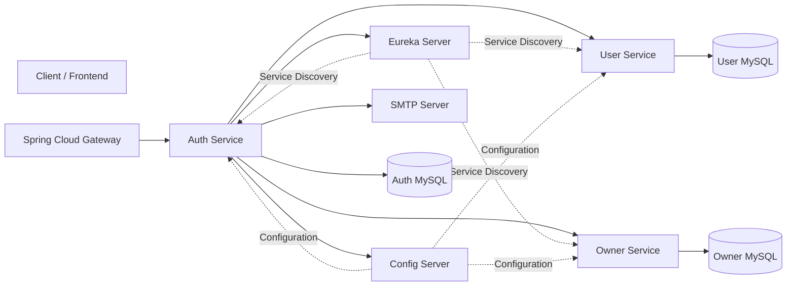

---

# 🔐 Authentication Responsibilities

The Auth Service acts as the identity provider for the StayEase platform.

Its primary responsibilities include:

- Registering new users.
- Authenticating user credentials.
- Issuing JWT Access Tokens.
- Managing Refresh Tokens.
- Verifying email ownership.
- Resetting forgotten passwords.
- Changing existing passwords.
- Revoking refresh tokens during logout.
- Synchronizing authentication state with User Service and Owner Service.

By isolating authentication into a dedicated microservice, the remaining services remain focused on business functionality while relying on a centralized and secure authentication mechanism.

---

# 🌟 Why a Dedicated Authentication Service?

Separating authentication from business services provides several advantages:

- Centralized Security
- Stateless Authentication
- Reusable Identity Management
- Simplified Service Design
- Improved Maintainability
- Better Scalability
- Consistent Authorization Policies
- Easier Integration with Future Identity Providers
- Enterprise-Ready Architecture

---
# 📂 Project Structure

```text
stayease-auth-service
│
├── gradle/
│
├── src
│   ├── main
│   │
│   ├── java
│   │   └── com
│   │       └── stayease
│   │           └── auth_service
│   │
│   │               ├── config
│   │               │   ├── FeignConfig.java
│   │               │   ├── OpenApiConfig.java
│   │               │   ├── OwnerClient.java
│   │               │   ├── SecurityConfig.java
│   │               │   └── UserClient.java
│   │               │
│   │               ├── controller
│   │               │   └── AuthController.java
│   │               │
│   │               ├── dto
│   │               │   ├── request
│   │               │   └── response
│   │               │
│   │               ├── entity
│   │               │
│   │               ├── exception
│   │               │
│   │               ├── integration
│   │               │   ├── OwnerServiceGateway.java
│   │               │   └── UserServiceGateway.java
│   │               │
│   │               ├── repository
│   │               │
│   │               ├── service
│   │               │   ├── AuthService.java
│   │               │   ├── AuthServiceImpl.java
│   │               │   ├── EmailService.java
│   │               │   ├── EmailServiceImpl.java
│   │               │   └── JwtService.java
│   │               │
│   │               └── AuthServiceApplication.java
│   │
│   ├── resources
│   │   └── application.yaml
│   │
│   └── test
│       └── java
│           └── com
│               └── stayease
│                   └── auth_service
│
├── .gitattributes
├── .gitignore
├── LICENSE
├── README.md
├── build.gradle
├── gradlew
├── gradlew.bat
└── settings.gradle
```

---

# 📦 Package Responsibilities

| Package | Responsibility |
|----------|----------------|
| **config** | Spring Security configuration, OpenAPI configuration, Feign clients, and application-level configuration. |
| **controller** | Exposes REST endpoints for registration, login, refresh token, email verification, password reset, logout, and password management. |
| **dto** | Request and Response DTOs exchanged between clients and the Auth Service. |
| **entity** | JPA entities representing Users, Roles(Enum), Refresh Tokens, Email Verification Tokens, and Password Reset Tokens. |
| **integration** | Gateway layer responsible for resilient service-to-service communication using OpenFeign, Eureka Service Discovery, Retry, Circuit Breaker, and fallback mechanisms. |
| **exception** | Global exception handling along with business-specific exceptions for authentication workflows. |
| **repository** | Spring Data JPA repositories responsible for persistence operations. |
| **service** | Contains authentication business logic, JWT generation/validation, email services, and token lifecycle management. |
| **resources** | Spring Boot configuration, application properties, profiles, email configuration, and security settings. |
| **test** | Unit and integration tests covering controllers, repositories, and service layer. |

---

# 🏗 Layered Architecture

The Auth Service follows a layered architecture where each layer has a clearly defined responsibility.

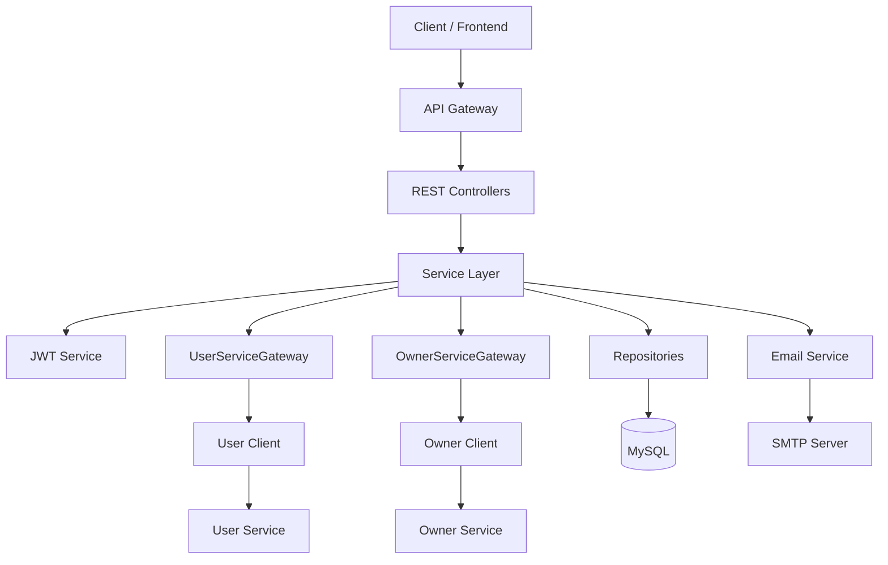

This separation of concerns improves maintainability, testability, and scalability.

---

# 📚 Package Overview

The Auth Service follows a modular layered architecture where each package has a single, well-defined responsibility. This separation of concerns improves maintainability, scalability, testability, and code readability.

---

## 📁 config

Contains application-wide configuration and infrastructure components.

**Responsibilities:**

- Spring Security Configuration
- OpenAPI / Swagger Configuration
- OpenFeign Client Configuration
- Feign Request Interceptor
- Authorization Header Propagation
- Correlation ID Propagation
- Feign Error Decoder
- Timeout & Retry Configuration

**Classes**

- `FeignConfig`
- `OpenApiConfig`
- `SecurityConfig`
- `UserClient`
- `OwnerClient`

---

## 📁 controller

Acts as the entry point for all authentication-related REST APIs.

**Responsibilities:**

- User Registration
- User Login
- Refresh Token
- Logout
- Email Verification
- Forgot Password
- Reset Password
- Change Password

---

## 📁 dto

Contains request and response models exchanged between clients and the Auth Service.

**Responsibilities:**

- API Request DTOs
- API Response DTOs
- Downstream Service DTOs

---

## 📁 entity

Represents the authentication domain model persisted in the database.

**Entities**

- User
- RefreshToken
- EmailVerificationToken
- PasswordResetToken
- Role (Enum)

---

## 📁 exception

Provides centralized exception handling and business-specific exceptions.

**Responsibilities:**

- Global Exception Handling
- Validation Errors
- Authentication Errors
- Token Exceptions
- Business Exceptions
- Standardized Error Responses

---

## 📁 integration

Acts as the gateway layer for resilient service-to-service communication.

**Responsibilities:**

- User Service Integration
- Owner Service Integration
- Service Discovery (Eureka)
- OpenFeign Communication
- Retry
- Circuit Breaker
- Fallback Handling

**Classes**

- `UserServiceGateway`
- `OwnerServiceGateway`

---

## 📁 repository

Handles persistence operations using Spring Data JPA.

**Responsibilities:**

- CRUD Operations
- User Lookup
- Refresh Token Management
- Email Verification Token Management
- Password Reset Token Management

---

## 📁 service

Contains the core authentication business logic.

**Responsibilities:**

- User Registration
- User Authentication
- JWT Generation & Validation
- Refresh Token Management
- Email Verification
- Password Recovery
- Password Change
- Logout
- Email Delivery

**Key Services**

- `AuthService`
- `AuthServiceImpl`
- `JwtService`
- `EmailService`
- `EmailServiceImpl`

---

## 📁 resources

Contains externalized application configuration.

**Responsibilities:**

- Spring Profiles
- Database Configuration
- Mail Configuration
- JWT Configuration
- Eureka Configuration
- Feign Configuration
- Resilience4j Configuration
- Logging Configuration

---

## 📁 test

Contains unit and integration tests for validating the application's behavior.

---

## 📁 AuthServiceApplication

Application bootstrap class responsible for starting the Spring Boot application and enabling component scanning, service discovery, and auto-configuration.
# 🔄 Authentication Lifecycle

Every authentication request follows a structured processing pipeline.

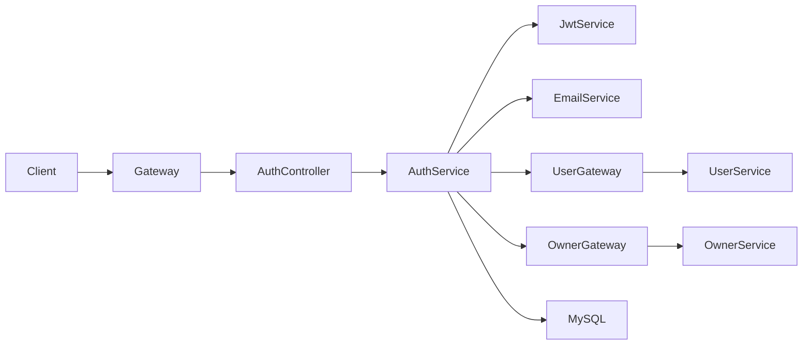

---

# 👤 User Registration Flow

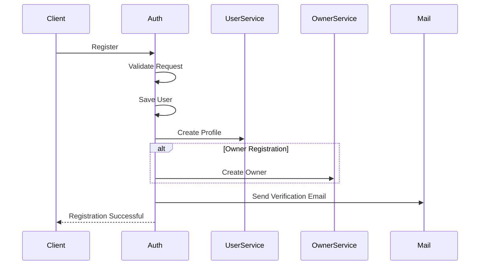

---

# 🔐 Login Flow

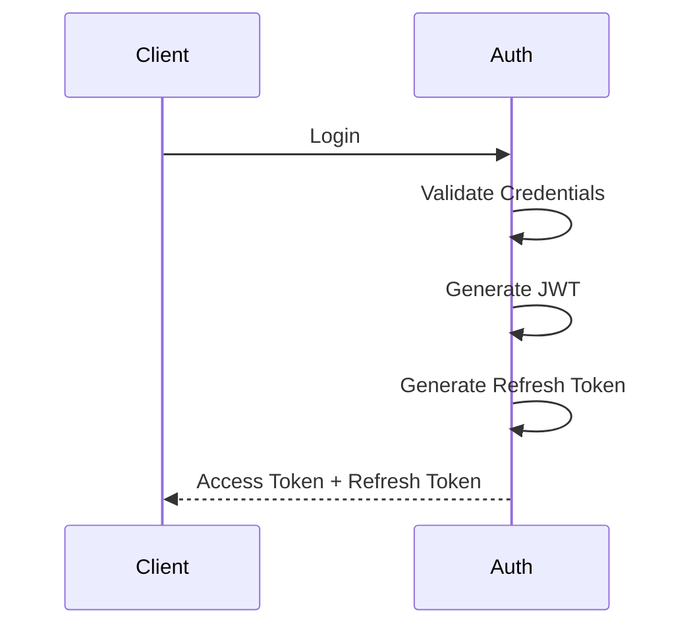
---

# 🎫 JWT Authentication Flow

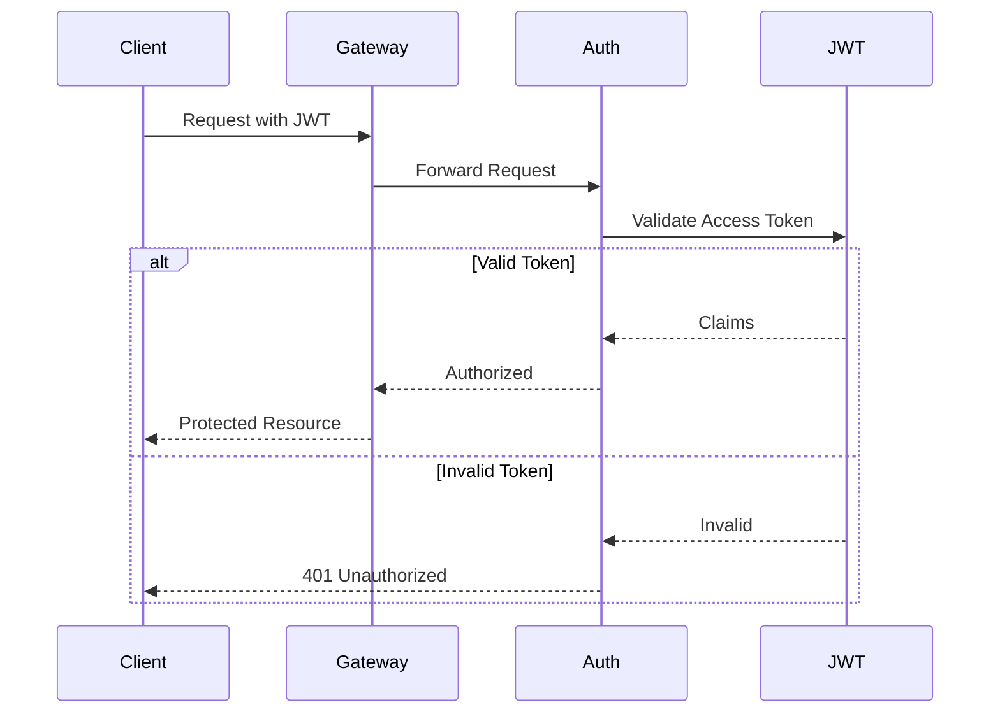
---

# 🔄 Refresh Token Flow

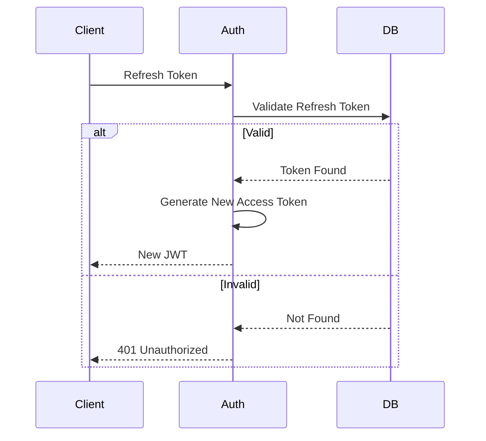
---

# 📧 Email Verification Flow

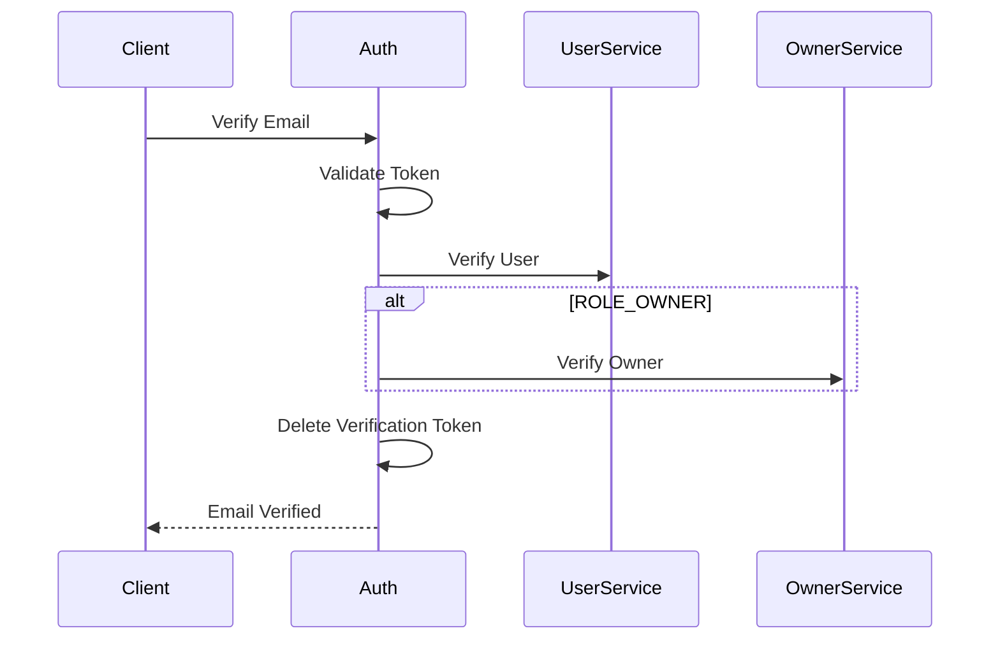
---

# 🔑 Forgot Password Flow

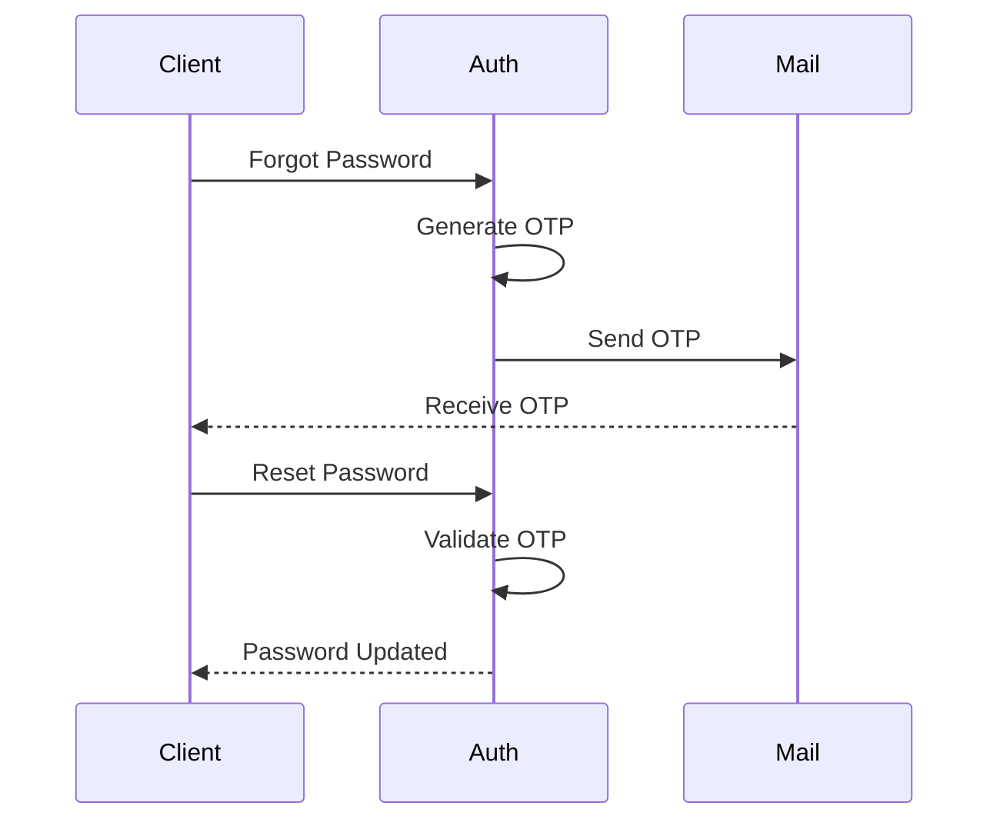

---

# 🚪 Logout Flow

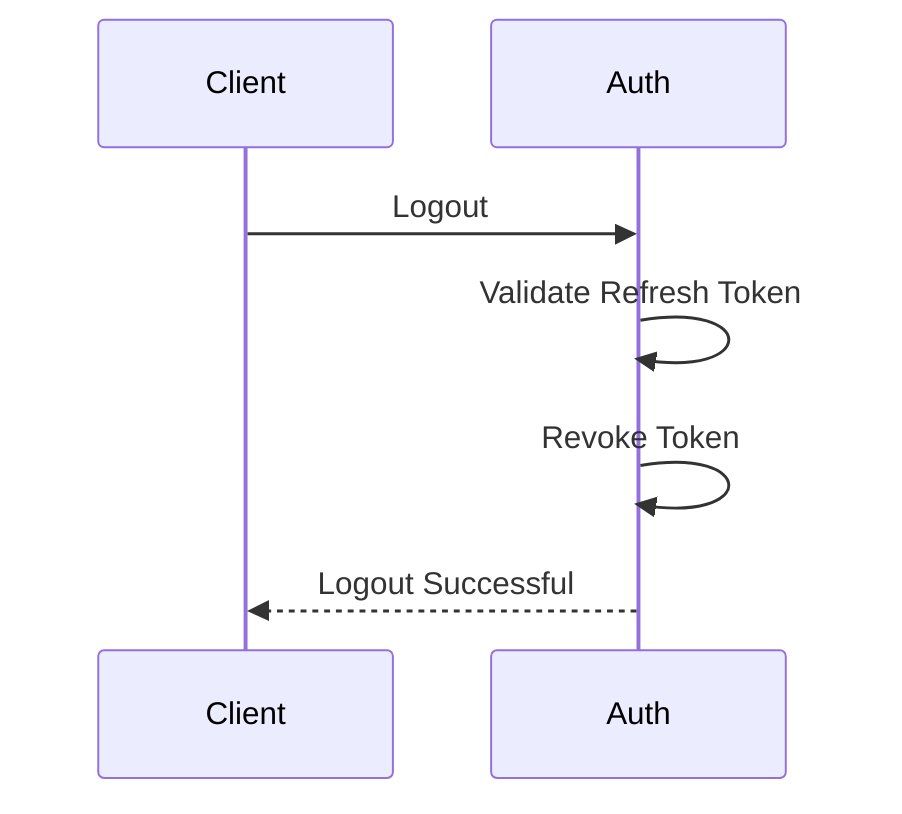

---

# 🎯 Why Separate Authentication?

Separating authentication into its own microservice provides several enterprise advantages.

- Centralized Identity Management
- Stateless Authentication
- Secure Token Lifecycle
- Reusable Authentication Logic
- Reduced Code Duplication
- Simplified Business Services
- Consistent Security Policies
- Scalable Authentication Infrastructure
- Easier Future OAuth2/OpenID Connect Integration

---
# 🛡 Security Strategy

Security is the primary responsibility of the StayEase Auth Service.

The service follows a **stateless authentication model** using JSON Web Tokens (JWT) while leveraging Refresh Tokens to provide secure long-lived sessions.

Every authentication request passes through multiple validation layers before granting access.

The implemented security mechanisms include:

- JWT Access Token Authentication
- Refresh Token Lifecycle Management
- BCrypt Password Hashing
- Email Verification
- Password Reset Verification
- Spring Security
- Role-Based Authentication
- Stateless Session Management
- Secure Token Expiration

This layered security model minimizes unauthorized access while maintaining scalability across distributed microservices.

---
## 🔐 Idempotency
The Auth Service implements idempotent behavior for critical authentication workflows.

Implemented:

- Logout is idempotent.
- Email verification token can only be consumed once.
- Password reset removes previously generated OTPs before issuing a new one.
- Refresh token rotation prevents token reuse.
- Duplicate registration is prevented through unique email validation.

These mechanisms ensure repeated client requests do not produce inconsistent system state.


# 🔑 JWT Strategy

The Auth Service issues two different tokens during authentication.

| Token | Purpose | Lifetime |
|---------|----------|-----------|
| Access Token | Authenticate API Requests | Short-lived |
| Refresh Token | Generate New Access Tokens | Long-lived |

---

## Access Token

The Access Token is attached to every authenticated request.

Responsibilities:

- User Authentication
- User Identity
- Role Information
- Stateless Authorization

Since the Access Token has a relatively short lifetime, the security impact of token leakage is minimized.

---

## Refresh Token

Refresh Tokens enable users to remain logged in without repeatedly entering credentials.

Responsibilities include:

- Generating new Access Tokens
- Maintaining long-lived sessions
- Supporting secure logout
- Token revocation

Unlike Access Tokens, Refresh Tokens are persisted in the database, allowing the system to invalidate active sessions during logout or suspicious activity.

---

# 🔐 Password Security

Passwords are never stored in plain text.

The Auth Service uses **BCrypt Password Encoder** provided by Spring Security.

Password workflow:

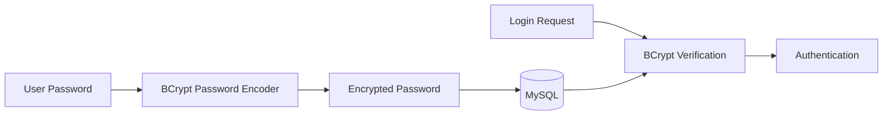

This ensures user credentials remain protected even if the database is compromised.

---

# 📧 Email Verification Strategy

To prevent fake or inactive accounts, newly registered users must verify their email address before fully activating their account.

Verification workflow:

- Generate Verification Token
- Persist Verification Token
- Send Verification Email
- Validate Verification Token
- Activate Account
- Synchronize Verification Status with User/Owner Service

Benefits:

- Prevents fake registrations
- Ensures valid email ownership
- Improves platform security
- Reduces spam accounts

---

# 🔑 Password Recovery Strategy

Users who forget their password can securely reset it without exposing their existing credentials.

The recovery process includes:

- Email validation
- Password reset token generation
- Secure reset link
- Token validation
- Password update using BCrypt

Each reset token has an expiration time and becomes invalid after successful use.

---

# 🚪 Logout Strategy

The Auth Service implements secure logout using Refresh Token revocation.

Logout workflow:

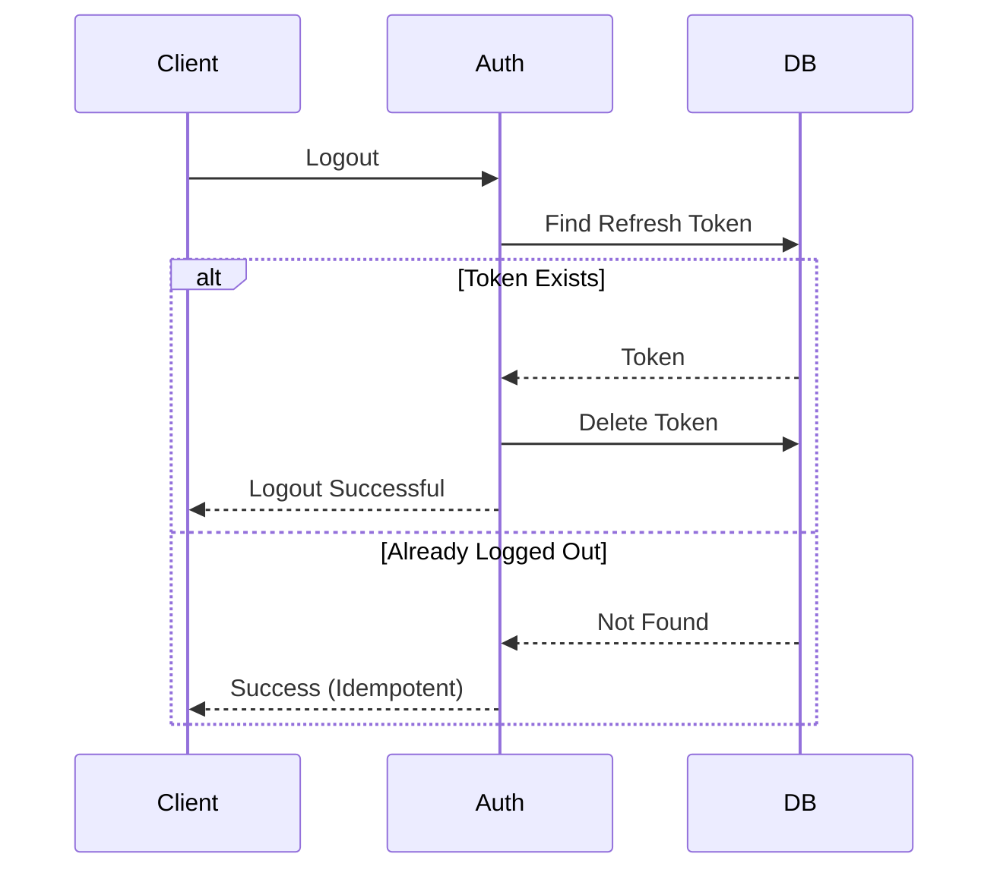
By revoking the Refresh Token, clients can no longer obtain new Access Tokens after logout.

---

# 🗄 Database Design

The Auth Service maintains authentication-specific entities only.

| Entity | Responsibility |
|----------|----------------|
| User | Stores authentication credentials and account status. |
| Role(ENUM) | Defines user roles(Not Stored in DB) |
| RefreshToken | Stores active refresh tokens for authenticated sessions. |
| EmailVerificationToken | Stores verification tokens used during email activation. |
| PasswordResetToken | Stores password recovery tokens. |

Separating authentication data from domain-specific user information follows the **Database per Service** pattern commonly used in microservices architecture.

---

# 🔄 Service Communication

The Auth Service communicates with other services using **OpenFeign**.

Current integrations include:

- User Service
- Owner Service

Responsibilities:

- Create user profile after registration
- Synchronize email verification status
- Maintain consistency between authentication data and profile data

This loose coupling enables services to evolve independently while maintaining business consistency.

---

# 🌍 Spring Profiles

The application supports multiple runtime environments using Spring Profiles.

| Profile | Purpose |
|----------|----------|
| local | Local Development |
| cut | Component Unit Testing |
| ete | End-to-End Testing |
| drt | Development Regression Testing |
| test | Automated Testing |
| prod | Production Deployment |

Each environment maintains independent configuration without requiring source code changes.

---

# ⚙ Externalized Configuration

The Auth Service externalizes all environment-specific settings.

Examples include:

- Database Configuration
- JWT Secret
- JWT Expiration
- Email SMTP Configuration
- Feign Client Configuration
- Logging Levels
- Spring Profiles

Externalizing configuration simplifies deployment across development, testing, and production environments.

---

# 📋 Logging Strategy

The application uses distributed request tracing using Correlation IDs across downstream services and structured logging to simplify debugging and production monitoring.

The following events are logged:

Authentication

- User Registration
- Successful Login
- Failed Login
- Logout

Token Management

- JWT Generation
- Refresh Token Generation
- Refresh Token Validation
- Token Revocation

Account Management

- Email Verification
- Forgot Password
- Password Reset
- Change Password

Error Handling

- Authentication Failures
- Validation Errors
- Business Exceptions

Logging sensitive information such as passwords or JWT secrets is intentionally avoided.

---
## 📊 Observability
The Auth Service includes production-grade observability features.

Implemented

- Spring Boot Actuator
- Health Endpoint
- Metrics Endpoint
- Logger Endpoint
- Environment Endpoint
- Readiness Information


# 🚨 Exception Handling Strategy

The Auth Service implements centralized exception handling using a Global Exception Handler.

Business-specific exceptions include:

- Invalid Credentials
- User Not Found
- Email Already Exists
- Email Not Verified
- Email Already Verified
- Invalid Verification Token
- Verification Token Expired
- Invalid Refresh Token
- Refresh Token Expired
- Refresh Token Revoked
- Invalid Password Reset Token
- Password Reset Token Expired
- Invalid OTP
- OTP Expired
- OTP Already Used

Centralized exception handling provides consistent API responses while simplifying maintenance.

---

# 🏭 Production Readiness

The StayEase Auth Service incorporates several production-oriented practices.

Implemented:

- Spring Security
- JWT Authentication
- Refresh Token Management
- BCrypt Password Hashing
- Stateless Authentication
- Email Verification
- Password Recovery
- Secure Logout
- OpenFeign Integration
- Global Exception Handling
- Bean Validation
- Externalized Configuration
- Layered Architecture
- Netflix Eureka Service Discovery
- Spring Cloud Config
- Spring Cloud Gateway
- Resilience4j Retry
- Circuit Breaker
- Correlation ID Propagation
- Feign Request Interceptor
- Spring Boot Actuator
- Distributed Logging Support
- Idempotent Operations
  
---

# 🚀 Future Enhancements

The following enhancements are planned for future iterations.

Security

- Multi-Factor Authentication (MFA)
- OAuth2 / OpenID Connect
- Social Login (Google, GitHub)

Reliability

- Redis Token Cache
- Login Rate Limiting
- Account Lockout Policies

Observability

- Prometheus
- Grafana
- OpenTelemetry
- Distributed Tracing

Infrastructure
- Kafka Event Publishing
- Docker
- Kubernetes
- CI/CD Pipeline

These enhancements will further improve scalability, security, and operational visibility in production environments.

---
# 🔐 Authentication Design Principles

The StayEase Auth Service was designed following modern enterprise authentication practices commonly adopted in distributed microservices architectures.

Rather than focusing solely on implementing authentication features, the service emphasizes security, scalability, maintainability, and loose coupling through carefully chosen architectural patterns.

The following design principles influenced the implementation.

---

## Why JWT Instead of HTTP Sessions?

The Auth Service uses **JSON Web Tokens (JWT)** instead of traditional server-side HTTP sessions.

### Reasons

- Stateless authentication
- Improved horizontal scalability
- Reduced server memory usage
- Better support for distributed microservices
- No session replication required
- Suitable for cloud-native deployments

Unlike HTTP Sessions, JWT allows every request to carry its own authentication information, enabling any service to validate the token independently.

---

## Why Access Token + Refresh Token?

Using only a long-lived JWT introduces security risks if the token is compromised.

To address this, the service separates authentication into two token types.

### Access Token

- Short-lived
- Used for API authentication
- Contains authenticated user information

### Refresh Token

- Long-lived
- Stored securely in the database
- Used only to obtain a new Access Token
- Can be revoked during logout

This strategy balances usability and security by minimizing the lifetime of exposed Access Tokens while allowing users to remain authenticated without repeated logins.

---

## Why Email Verification?

User registration is not considered complete until the email address is verified.

This provides several benefits:

- Prevents fake account creation
- Ensures ownership of the registered email
- Reduces spam registrations
- Improves platform trust
- Enables reliable communication with users

Only verified accounts are allowed to access protected platform features.

---

## Why BCrypt Password Hashing?

Passwords are never stored in plain text.

Instead, the Auth Service uses **BCrypt**, a secure password hashing algorithm provided by Spring Security.

Advantages include:

- One-way hashing
- Automatic salting
- Resistance to rainbow table attacks
- Adaptive computational cost
- Widely adopted industry standard

Even if the database were compromised, original user passwords cannot be recovered from BCrypt hashes.

---

## Why Refresh Tokens Are Stored in the Database?

Unlike Access Tokens, Refresh Tokens are persisted in the database.

This enables the system to:

- Revoke active sessions
- Support secure logout
- Detect expired tokens
- Prevent reuse of revoked tokens
- Manage multiple user sessions

Persisting Refresh Tokens provides greater control over session management compared to purely stateless authentication.

---

## Why Database per Service?

The Auth Service maintains its own dedicated authentication database.

Only authentication-related information is stored, including:

- User Credentials
- Roles
- Refresh Tokens
- Email Verification Tokens
- Password Reset Tokens

Business-specific profile information remains within the User Service and Owner Service.

This follows the **Database per Service** pattern, reducing coupling between microservices and allowing each service to evolve independently.

---

## Why OpenFeign for Service Synchronization?

Authentication data alone is insufficient for the StayEase platform.

After successful registration and email verification, the Auth Service synchronizes information with downstream services using OpenFeign.

Responsibilities include:

- Creating User profiles
- Creating Owner profiles
- Updating email verification status
- Maintaining data consistency

Using OpenFeign provides:

- Clean declarative HTTP clients
- Reduced boilerplate code
- Strong service abstraction
- Easier maintainability

---

## Why Centralized Authentication?

Instead of implementing authentication inside every microservice, StayEase centralizes all identity management within the Auth Service.

This architecture provides several advantages:

- Single authentication source
- Consistent security policies
- Simplified business services
- Reduced code duplication
- Easier maintenance
- Independent authentication lifecycle
- Better scalability

Business services such as Property, Booking, Payment, and Notification focus entirely on domain logic while delegating authentication responsibilities to the Auth Service.

---

## Why Stateless Authentication?

The Auth Service does not maintain server-side user sessions.

Each authenticated request is self-contained through JWT.

Benefits include:

- Horizontal scalability
- Load-balancer friendly architecture
- Reduced server memory consumption
- Simpler deployment
- Better cloud compatibility

This design aligns with modern microservices and cloud-native architectures.

---

## Enterprise Design Summary

The StayEase Auth Service combines several enterprise authentication patterns to provide a secure, scalable, and maintainable authentication platform.

Key architectural decisions include:

- JWT-Based Stateless Authentication
- Access Token + Refresh Token Strategy
- BCrypt Password Hashing
- Email Verification Workflow
- Password Recovery Workflow
- Refresh Token Revocation
- Database per Service Pattern
- OpenFeign Service Communication
- Centralized Authentication
- Layered Architecture

These principles collectively establish a robust authentication foundation capable of supporting secure communication across the entire StayEase microservices ecosystem while remaining flexible for future enhancements such as OAuth2, Multi-Factor Authentication (MFA), Single Sign-On (SSO), and distributed token caching.

---
# 🚀 Getting Started

This section explains how to set up and run the StayEase Auth Service in a local development environment.

---

# 📋 Prerequisites

Ensure the following software is installed before running the project.

| Software | Version |
|----------|---------|
| Java | 21 or later |
| Gradle | 8.x or later (Wrapper Included) |
| MySQL | 8.x or later |
| Git | Latest |
| IntelliJ IDEA / VS Code | Recommended |

---

# 📥 Clone the Repository

```bash
git clone https://github.com/PSaiRam32/stayease-auth-service.git

cd stayease-auth-service
```

---

# ⚙ Configure the Application

Update the active Spring profile if necessary.

Example:

```yaml
spring:
  profiles:
    active: local
```

Configure the required properties.

Examples include:

- Database Connection
- JWT Secret
- JWT Expiration
- Refresh Token Expiration
- SMTP Mail Configuration
- Feign Client URLs

---

# 🗄 Configure MySQL

Create a database for the Auth Service.

Example:

```sql
CREATE DATABASE stayease_auth_service;
```

Update the datasource configuration accordingly.

---

# ▶ Run the Application

Using Gradle Wrapper:

Linux / macOS

```bash
./gradlew bootRun
```

Windows

```cmd
gradlew.bat bootRun
```

Or build the project:

```bash
./gradlew clean build
```

Run the generated JAR:

```bash
java -jar build/libs/auth-service.jar
```

---

# 🌐 API Endpoints

The Auth Service exposes REST APIs for authentication and account management.

Major endpoints include:

| Category | Example APIs |
|-----------|--------------|
| Authentication | Register, Login, Refresh Token |
| Email Verification | Verify Email |
| Password Recovery | Forgot Password, Reset Password |
| Password Management | Change Password |
| Session Management | Logout |

Refer to the Swagger/OpenAPI documentation for the complete API specification.

---

# 🧪 Testing

Recommended testing scenarios include:

## Registration

- Successful Registration
- Duplicate Email
- Invalid Input Validation

---

## Login

- Valid Credentials
- Invalid Password
- Invalid Email
- Unverified Email

---

## JWT

- Generate Access Token
- Validate JWT
- Expired JWT
- Invalid JWT

---

## Refresh Token

- Generate Refresh Token
- Refresh Access Token
- Expired Refresh Token
- Revoked Refresh Token

---

## Email Verification

- Valid Verification Link
- Expired Verification Token
- Invalid Verification Token
- Already Verified Account

---

## Forgot Password

- Valid Email
- Invalid Email
- Expired Reset Token
- Successful Password Reset

---

## Logout

- Successful Logout
- Reuse Revoked Refresh Token

---

# 📊 Monitoring

The Auth Service can be monitored using Spring Boot Actuator.

Typical endpoints include:

```text
/actuator/health

/actuator/info

/actuator/metrics
```

These endpoints provide application health, runtime metrics, and operational information.

---

# 📈 Performance Considerations

The Auth Service has been designed for secure and efficient authentication.

Performance considerations include:

- Stateless JWT Authentication
- Lightweight JWT Validation
- Efficient Refresh Token Queries
- BCrypt Password Hashing
- Database Indexing for Token Lookups
- Externalized Configuration
- Optimized Service Communication using OpenFeign

These design decisions help maintain responsiveness while enforcing strong security.

---

# 🔒 Security Best Practices

The StayEase Auth Service follows several enterprise security practices.

Implemented:

- BCrypt Password Hashing
- JWT Authentication
- Refresh Token Management
- Email Verification
- Password Reset Tokens
- Stateless Authentication
- Bean Validation
- Secure Logout
- Authorization Header Propagation
- Correlation ID Propagation
- Service-to-Service Authentication

Recommended for Production:

- HTTPS/TLS
- Multi-Factor Authentication (MFA)
- OAuth2/OpenID Connect
- Login Rate Limiting
- Account Lockout Policies
- Secrets Management
- Audit Logging
- Security Monitoring

---

# 🤝 Contributing

Contributions are welcome.

To contribute:

1. Fork the repository.
2. Create a feature branch.

```bash
git checkout -b feature/your-feature-name
```

3. Commit your changes.

```bash
git commit -m "Add new feature"
```

4. Push your branch.

```bash
git push origin feature/your-feature-name
```

5. Open a Pull Request.

Please ensure all new features are documented and tested.

---

# 📄 License

This project is licensed under the MIT License.

See the LICENSE file for additional information.

---

# 👨‍💻 Author

**Sai Ram Paidipati**

Java Backend Developer

### GitHub

https://github.com/PSaiRam32

### LinkedIn

https://www.linkedin.com/in/sairam-paidipati/

---

# 📬 Support

If you have any questions, suggestions, or encounter issues:

- Open an Issue
- Submit a Pull Request
- Reach out via LinkedIn

Feedback and contributions are always welcome.

---

# 🎯 Key Learning Outcomes

This project demonstrates practical implementation of enterprise authentication and security concepts, including:

- Spring Security
- JWT Authentication
- Refresh Token Lifecycle Management
- Stateless Authentication
- Email Verification
- Password Recovery Workflow
- BCrypt Password Encoding
- Spring Data JPA
- REST API Design
- Layered Architecture
- Global Exception Handling
- Environment-Based Configuration
- Enterprise Authentication Design
- Netflix Eureka
- Spring Cloud Config
- Spring Cloud Gateway
- OpenFeign
- Resilience4j Retry
- Circuit Breaker
- Idempotent API Design
- Correlation ID Propagation
- Spring Boot Actuator


---

# 📚 References

This project was developed using concepts and best practices from:

- Spring Boot
- Spring Security
- Spring Data JPA
- Spring Cloud OpenFeign
- JWT (JSON Web Token)
- BCrypt Password Encoding
- REST API Design Principles
- Enterprise Authentication Patterns
- Microservices Architecture
- Spring Cloud Netflix Eureka
- Spring Cloud Gateway
- Spring Cloud Config
- Resilience4j
- Spring Boot Actuator
  
---

# 📝 Project Summary

The StayEase Auth Service serves as the centralized authentication and identity management component within the StayEase microservices ecosystem.

By leveraging Spring Security, JWT, Refresh Tokens, OpenFeign, and secure authentication workflows, the service provides a scalable, stateless, and production-oriented authentication solution.

It demonstrates how authentication can be isolated into a dedicated microservice, enabling other services to focus on business functionality while relying on a secure and consistent identity provider.

The project establishes a strong foundation for future enhancements such as OAuth2, Multi-Factor Authentication, distributed caching, Kubernetes deployment, and enterprise observability, making it an excellent reference for secure Java backend development.

---

# 🙏 Acknowledgements

This project was built as part of the **StayEase Microservices Backend** to explore enterprise authentication mechanisms and secure identity management in distributed systems.

Special focus areas include:

- JWT-Based Authentication
- Refresh Token Management
- Stateless Security
- Email Verification Workflow
- Password Recovery Workflow
- Secure Password Hashing
- Enterprise Authentication Design
- OpenFeign Service Communication
- Layered Architecture
- Production-Oriented Security Practices

This project served as a practical implementation of authentication and authorization concepts commonly adopted in enterprise backend systems.

Thank you for exploring this repository. Feedback, suggestions, and contributions are always appreciated.
